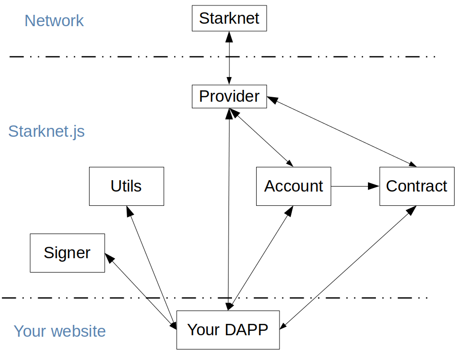

# What's Starknet.js ?

Starknet.js is a way to connect your website or your Digital Application (DAPP) to the blockchain-based Starknet network, using Javascript/Typescript language.

## Overview :

Some important topics that have to be understood:

- You can connect your DAPP to several networks :

  - [Starknet mainnet](https://starkscan.co) (Layer 2 of [Ethereum network](https://etherscan.io/) ).
  - [Starknet testnet 1](https://testnet.starkscan.co/) & [testnet 2](https://testnet-2.starkscan.co/) (Layer 2 of [Goerli network](https://goerli.etherscan.io/) (testnet of Ethereum)).
  - [Starknet-devnet](https://shard-labs.github.io/starknet-devnet/docs/intro) (your local Starknet network, for developers).

  and also to some more specific solutions :

  - private customized version of Starknet.
  - local Starknet node (connected to mainnet or testnet).

- Only the Provider object is talking directly to the network ; your DAPP will talk mainly to Account and Contract objects. You will define with the Provider on which network you want to work. You can ask to the Provider some low level data of the network (block,timestamp, ...).
- Signer and Utils objects contains many useful functions for the interaction with Starknet.js.
- The Contract object is mainly used to read the memory of a blockchain contract.
- The Account object is the most useful :
  - as wallet, to store your tokens.
  - as a way to pay the fees to the network, to be able to write in its memory.
